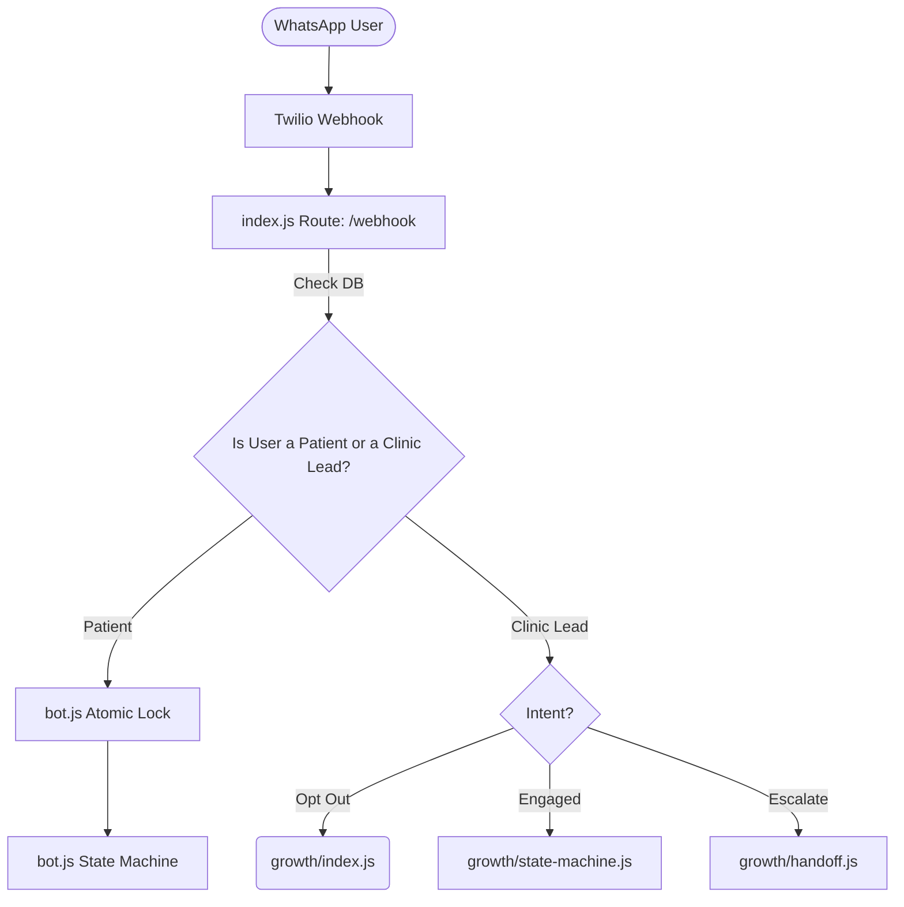

# 🌌 Full System Architecture: Dental Bot & Qudozen Growth Swarm

This document provides a comprehensive breakdown of the entire dual-system architecture. The platform operates as two distinct but interconnected systems:
1. **The Core Dental Bot**: An autonomous AI receptionist that handles inbound patient traffic for dental clinics (booking, qualifying, answering questions).
2. **The Growth Swarm (Qudozen)**: An autonomous outbound sales engine that scouts for new dental clinics, pitches them the Dental Bot, and handles objections until they buy.

---

## 🏗️ High-Level Traffic Flow (The Traffic Cop)

The entry point for *all* WhatsApp messages is the `index.js` Express server. It acts as the "Traffic Cop", routing messages based on who the sender is.

---

## 🦷 1. The Core Dental Bot (Inbound Patient Reception)

**Purpose**: Act as a 24/7 AI Receptionist for dental clinics. It qualifies patients, answers clinic-specific questions, and securely books appointments into Google Calendar.

### Key Components:

#### `bot.js` (The Brain)
- **Job**: Manages the patient conversation state machine (Language Selection ➔ Greeting ➔ Qualifying ➔ Booking). It uses a strict `userLocks` atomic locking mechanism to ensure a patient sending multiple rapid messages doesn't cause race conditions. It calls the OpenAI GPT-4o-mini API using "Function Calling" to determine when to trigger scheduling.
- **Output**: Generates conversational responses and determines the next `flow_step` in the database.

#### `calendar.js` & `slots.js` (The Scheduler)
- **Job**: `calendar.js` manages Google Calendar API syncing, inserting events, and detecting conflicts. `slots.js` calculates available time slots by reading the clinic's business hours, the doctor's specific schedule, and currently booked appointments from the database.
- **Output**: Returns an array of formatted available time slots to `bot.js` so the AI can present them to the patient via WhatsApp Interactive Lists.

#### `db.js` (The Memory)
- **Job**: The centralized Supabase wrapper for the Core Bot. 
- **Output**: Executes all `select`, `update`, and `insert` operations for `patients`, `appointments`, and `clinics`.

#### `whatsapp.js` & `whatsapp-lists.js` (The Voice)
- **Job**: Wraps the Twilio API to send rich media. `whatsapp-lists.js` specifically constructs Interactive WhatsApp Lists (menus) and Buttons, which dramatically improve patient conversion rates compared to typing numbers.
- **Output**: Fires HTTP requests to the Twilio REST API to deliver the final message to the patient's phone.

#### `monitor.js` (The Immune System)
- **Job**: A self-healing script run by a cron job every 10 minutes. It pings OpenAI, checks Supabase connectivity, and ensures the Twilio webhook is active.
- **Output**: If a failure is detected, it logs the error and can alert the admin, ensuring the bot never dies silently.

---

## 🐝 2. The Growth Swarm (Outbound Sales Automation)

**Purpose**: The Qudozen engine. It autonomously scouts the internet for dental clinics, reaches out to them via WhatsApp, pitches the Dental Bot, handles their objections, and escalates to a human closer when they show buying intent.

### Key Components:

#### `growth/scouts/orchestrator.js` (The Hunter)
- **Job**: Runs via cron job. It spins up specific scrapers (`indeed.js`, `googlePlaces.js`, `jobPortals.js`) to scan the web for dental clinics hiring receptionists or lacking automation.
- **Output**: Extracts Clinic Name, Phone Number, City, and a "Pain Signal" (e.g., "Hiring Receptionist"). Inserts these raw leads into the `growth_leads_v2` database table.

#### `growth/sender.js` (The Icebreaker)
- **Job**: The daily auto-batch engine. At 10 AM, it grabs the top uncontacted leads, generates a highly personalized cold-outreach WhatsApp message (using the pain signal), and sends it.
- **Output**: Bridges the lead from the legacy table into the GS 3.0 `gs_leads` state machine and logs the sent message to `gs_conversations`.

#### `growth/state-machine.js` (The Negotiator)
- **Job**: When a clinic owner replies to the cold outreach, this script takes over. It uses OpenAI to classify their intent (`QUALIFYING`, `OBJECTION_HANDLING`, `BOOKING_PITCH`, `ESCALATED`) and generates a persuasive, context-aware response based on the Qudozen playbook.
- **Output**: Updates `gs_leads.conversation_state`, saves the chat history to `gs_conversations`, and sends the WhatsApp reply.

#### `growth/nurture.js` (The Follow-Up Engine)
- **Job**: Runs daily to check for leads who stopped replying. It generates a 2-step drip campaign (e.g., waiting 4 days, then sending a soft bump like "Did you see my last message?").
- **Output**: Automatically nudges ghosting prospects and pauses itself if they reply.

#### `growth/handoff.js` (The Closer Alert)
- **Job**: Monitors the state machine for "Buying Signals" (e.g., asking for price, agreeing to a demo, or getting angry). 
- **Output**: Instantly sends a WhatsApp alert to the human Admin (`ADMIN_PHONE`) summarizing the lead's status, and pushes the lead into the Dental Bot's `patients` table so the clinic owner can experience the "Ghost Room" bot simulation firsthand.

#### `growth/brain.js` (The Guardrails)
- **Job**: Contains the system prompts, safety guardrails, and language detection rules. It ensures the AI never hallucinates pricing, never breaks character, and always speaks the appropriate language (Arabic/English).
- **Output**: Returns system instruction strings injected into the OpenAI API calls.

---

## 🖥️ 3. Dashboards & Interfaces

#### `public/index.html` (The Unstoppable Sales Funnel)
- **Job**: The public-facing Qudozen marketing website. Highly optimized Arabic RTL design featuring a liquid/water aesthetic, glassmorphism, and dynamic animations.
- **Output**: Educates the visitor and pushes them to trigger the WhatsApp bot simulation.

#### `growth/ghost-room.html` (The Live Simulation)
- **Job**: A dedicated URL (`/growth/ghost-room?clinic=X&city=Y`) that clinic owners are sent to when they want to see the bot in action. It visually simulates a "live" command center.
- **Output**: Tracks "dwell time" (how long the owner watches the screen) and reports it back to the server via `/api/ghost-dwell`.

#### `growth/index.js` (The Admin Control Center)
- **Job**: Contains the Express routes for the HTML-based Admin Dashboard (`/growth/dashboard`). 
- **Output**: Renders a dark-mode table unifying data from both `growth_leads_v2` (new scout leads) and `gs_leads` (active AI conversations), allowing the human operator to monitor the entire pipeline, manually trigger batches, or manually intervene.

#### React `/dashboard` (Clinic Owner Portal)
- **Job**: A standalone React/Vite application. Once a clinic buys the system, they log in here to view their own metrics (Appointments, Leads, Doctors).
- **Output**: A compiled SPA (Single Page Application) served statically, communicating with Supabase.

---

## ⏱️ 4. The Cron Job Schedule (`index.js`)
The heartbeat of the entire autonomous system:
- **Every 10 mins**: `monitor.js` Health check.
- **Every 30 mins**: Sends appointment reminders to patients.
- **Hourly**: Cleans up expired calendar slots.
- **Daily 05:30 UTC (08:30 KSA)**: Morning Brief (sends the human Admin a WhatsApp summary of yesterday's best leads and today's appointments).
- **Daily 06:00 UTC (09:00 KSA)**: `nurture.js` runs automated follow-ups.
- **Daily 07:00 UTC (10:00 KSA)**: `sender.js` auto-batch sends cold outreach to 10 new clinics.
- **Every 6 Hours**: Job portal scouts hunt for new clinics.
- **Sundays**: Google Places scout runs deep sweeps.

---
*Generated by Antigravity AI — Universe-Level Architectural Audit*
