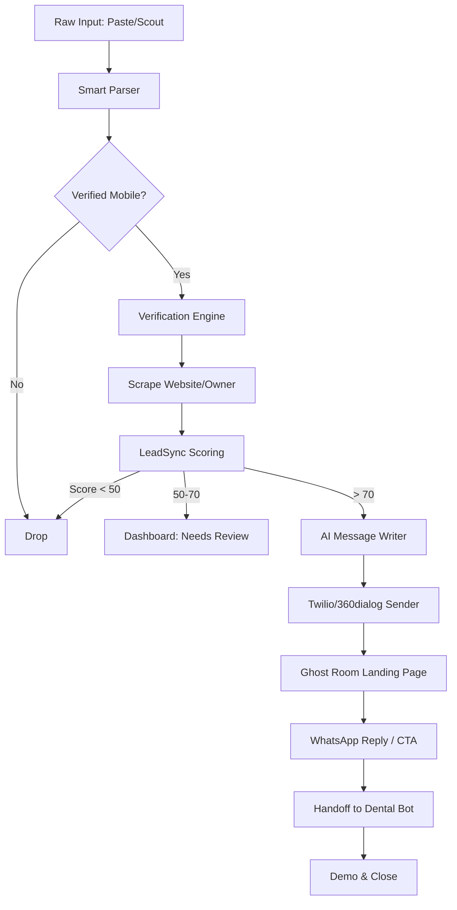

# Growth Swarm V2: Integrated Architecture Report

This report explains how the newly implemented components work together to form a seamless, automated, and Meta-ban-proof sales engine for your dental AI receptionist business.

---

## 🏗️ The 5-Layer Pipeline

The system is designed as a linear pipeline where raw data enters at Layer 0 and exits as a paying customer at Layer 5.

### Layer 0: Data Input (`smartParser.js`)
When you paste a raw string (e.g., from an Indeed job post or Google Maps) into the `/add-and-fire` endpoint:
- **Normalization:** Converts Arabic numerals and symbols to standardized formats.
- **Extraction:** A regex-based engine pulls the phone number, city, and clinic name.
- **Pain Detection:** It scans for keywords like "hiring" or "receptionist" to determine why the clinic needs your help.

### Layer 1: Verification & Discovery (`autoVerify.js`, `findWebsite.js`)
Before sending a message, the system verifies the lead:
- **Phone Classification:** `classifyPhone.js` determines if the number is a mobile (+966-5...) or a landline.
- **Website Hunting:** `findWebsite.js` tries 8 different domain patterns for the clinic.
- **Data Scraping:** If a site is found, it scrapes the **Owner's Name** and contact emails.

### Layer 2: LeadSync Scoring (`confidenceScore.js`)
Every lead is assigned a "Confidence Score" (0-100):
- **Fit:** Is it a dental clinic in a target Saudi city?
- **Pain:** Do we have high-intent signals (hiring, bad reviews)?
- **Reachability:** Do we have a verified mobile number?
- **Decision:**
    - **≥70:** Auto-messages the lead immediately.
    - **50-70:** Sends to **Needs Review** on your dashboard.
    - **<50:** Drops the lead to protect your Twilio sandbox limits.

### Layer 3: Outreach & Ghost Room (`sender.js`, `brain.js`, `ghost-room.html`)
- **AI Personalization:** `brain.js` uses GPT-4o-mini to write a one-sentence message in Arabic/English.
- **Personalized Link:** Every message includes a link to the **Ghost Room**, pre-loaded with the clinic's own name and city.
- **The Wow Factor:** The clinic owner sees an interactive "Lost Revenue" calculator showing exactly how much money they've leaked.

### Layer 4: Automated Handoff (`handoff.js`)
When the owner clicks the CTA in the Ghost Room or replies to the WhatsApp message:
- **Webhook Target:** The message hits your main `index.js`.
- **Automatic Handoff:** `handoff.js` detects they are a growth lead, converts them into a `patient` in your database, and starts the **Dental Bot** demo flow.
- **Live Demo:** The bot handles their booking, demonstrating its value in real-time.

---

## 📊 System Flow Diagram

---

## 🛡️ Meta-Ban-Proof Protections

| Component | Protection Mechanism |
| :--- | :--- |
| **Outreach** | Uses **Twilio Sandbox** by default. Your personal phone is never at risk. |
| **Scaling** | Moves to **360dialog** only when a client pays (API-official). |
| **Verification** | Owner-verification (≥70 score) ensures you only message relevant people, preventing spam flags. |
| **Payments** | No online processing. You handle IBAN/Bank transfers manually after the demo. |

---

## 🛠️ Management Tools
- **Growth Dashboard:** View leads, monitor scores, and manually approve "Review" candidates in a mobile-optimized Arabic UI.
- **Indeed Scout:** Run manually via API to refresh your pipeline with clinics that are **actively hiring** right now.

---

> [!TIP]
> This architecture ensures that you spend **0 minutes** on unqualified leads and only talk to clinic owners who have already seen the "Revenue Shock" and completed a successful bot demo.
